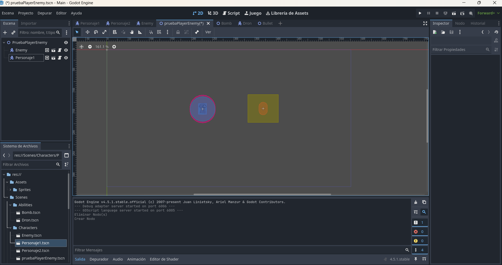
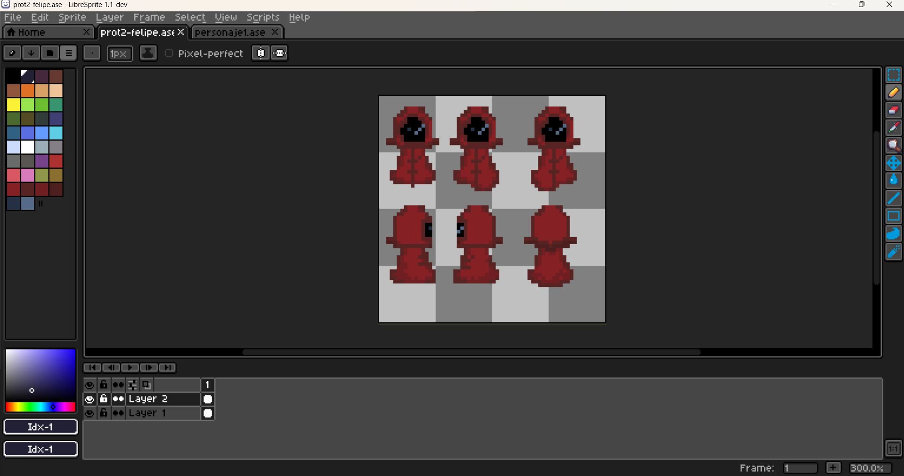
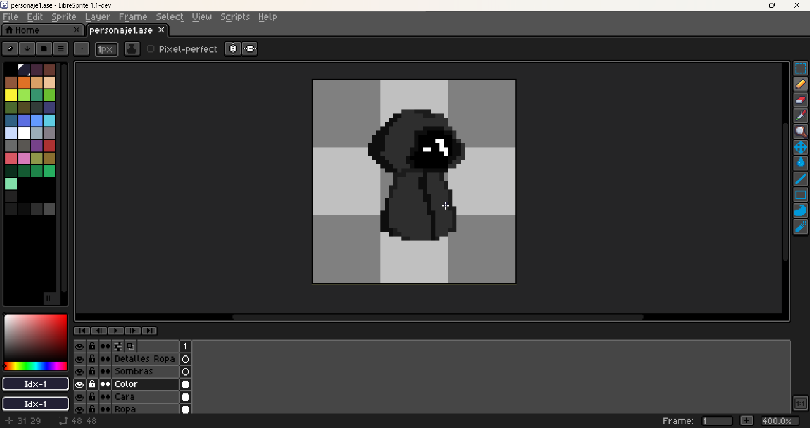

# 2D-Video-Game-Development-Project---Godot-4
This project consists of the development of a 2D video game built in Godot 4, focusing on gameplay systems, combat mechanics, and scalable architecture design.

## Overview

The primary objective is to implement core gameplay systems such as player movement, combat mechanics, enemy behavior, and damage processing, while maintaining a clean and scalable architecture.

The project focuses not only on gameplay functionality but also on system design principles, including modular structure, separation of responsibilities, and extensibility for future expansion.

Rather than serving as a finished product, this repository represents the technical foundation of a fully expandable 2D game framework.

## Development View

## 🎨Design Ideas

### Rogue

### Magic

## 🎮Core Systems Implemented

- **Player Movement System**
  - 2D directional movement using CharacterBody2D
  - Physics-based velocity handling
  - Expandable input structure

- **Combat System**
  - Collision-driven hit detection
  - Area2D-based attack zones
  - Damage application through modular functions

- **Enemy System**
  - Health management
  - Instance lifecycle handling (spawn and removal)
  - Group-based identification

- **Damage Processing**
  - Decoupled damage logic
  - Centralized health reduction handling
  - Death condition verification

- **Stat & Attribute Foundations**
  - Configurable speed and health variables
  - Exported properties for scalability
  - Base structure for future buff/debuff systems

## Combat Systems view
### Melee
-Personaje1.gif)

### Range
-Personaje2.gif)

## 🛠️Technologies Used

- **Godot 4** – Core game engine used for development  
- **GDScript** – Primary scripting language  
- **Godot 2D Physics Engine** – Collision detection and movement handling  
- **Scene-Based Architecture** – Modular structure using reusable scenes and nodes  
- **Git & GitHub** – Version control and repository management
- 
## 🚀Project Status

The project is currently in active development, with the core gameplay systems already implemented.

The current focus is on refining combat mechanics, improving system scalability, and expanding gameplay features while maintaining clean architecture principles.

## 🔮Future Improvements

- Expanded ability and skill system  
- More advanced enemy behaviors and AI logic  
- UI and visual feedback improvements  
- Enhanced animation polish  
- Save and load system  
- Audio implementation (sound effects and music)  
